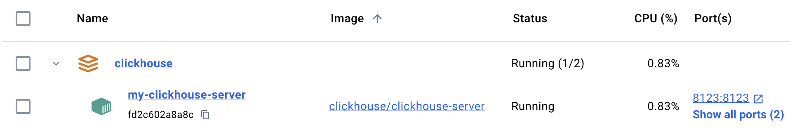
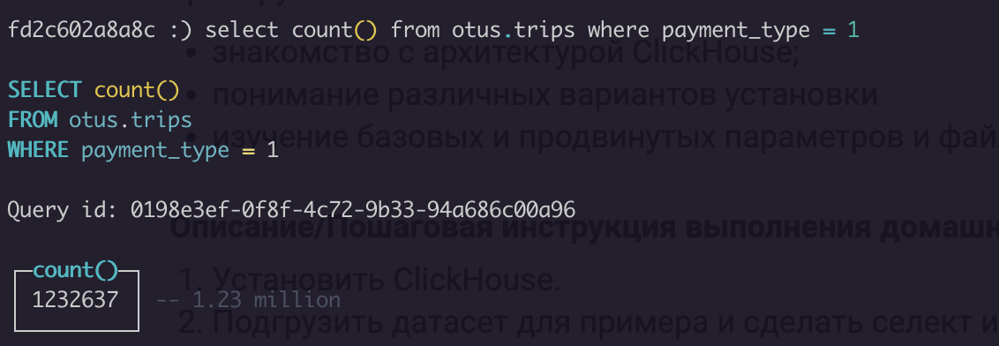
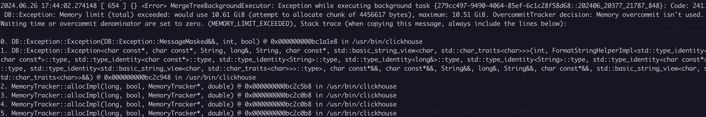
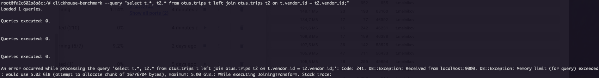
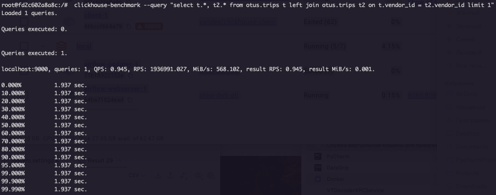

# Установка ClickHouse
ClickHouse установлен в докере:
1. Контейнер: [docker-compose.yaml](clickhouse/docker-compose.yaml)
2. Конфигурационные файлы ClickHouse: [configs](clickhouse/configs)
3. Настроены volumes (конфигурационные файлы, данные, логи) для удобства отладки.



# Загрузка датасета
[Скрипт загрузки датасета](sql/insert_trips.sql)



# Тестирование производительности, изучение конфигурационных файлов
Тестирование произодительности производилось запуском следующего запроса (`limit 1` установлен для уменьшения
времени возвращения результатов):
```sql
select
    t.*,
    t2.*
from otus.trips t
left join otus.trips t2 on t.vendor_id = t2.vendor_id
limit 1
```
```shell
clickhouse-benchmark --query "select t.*, t2.* from otus.trips t left join otus.trips t2 on t.vendor_id = t2.vendor_id limit 1"
```
## Запуск с параметрами по умолчанию
Запуск по умолчанию приводил к полной остановке ClickHouse (контейнер переходил в состояние `Exited`).


Для выяснения причины использовались логи сервера: `clickhouse-server.log`. После аудита логов выяснилось, что контейнер 
падал с Out of Memory. Установленного глобального лимита на ОЗУ в докере было недостаточного выполнения этого запроса.


Что бы контейнер не падал, был уставлено ограничение на максимальное использование ОЗУ (5 GB) для пользователя в [users.d/default.xml](clickhouse/configs/users.d/default.xml).
```xml
<max_memory_usage>5368709120</max_memory_usage>
```

После ограничения, контейнер падать перестал, однако теперь сам запрос падал по лимиту ОЗУ, из-за возможности уместить 
данные при джойне.


Для обхода ограничения, был принудительно уставлен алгоритм джойна, который сбрасывает на диск отсортированные результаты
правой таблицы: [users.d/default.xml](clickhouse/configs/users.d/default.xml).
```xml
<join_algorithm>partial_merge</join_algorithm>
```

В результате запрос выполнился и были получены результаты тестирования производительности.

