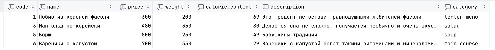
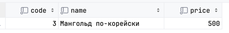
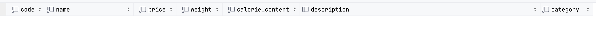
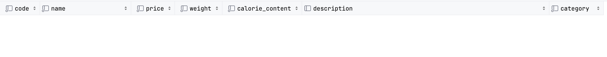
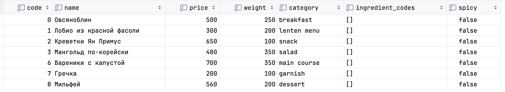
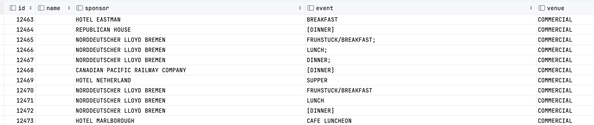
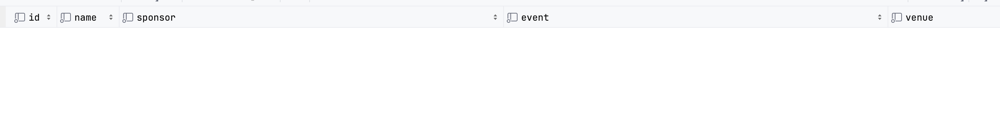
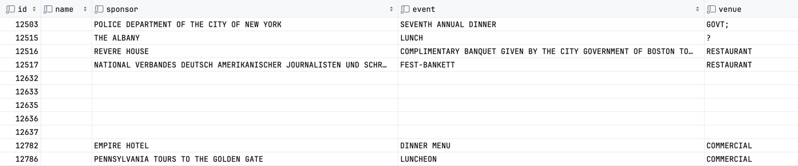

# 1. Cоздание БД для сущностей рестрона "Твои мечты"
Создание БД "Твои мечты"
```sql
create database your_dreams comment 'БД ресторана "Твои мечты"';
```
Переход в БД "Твои мечты"
```sql
use your_dreams;
```
# 2. Создание таблицы для бизнес-кейса "Меню ресторана"
Создаем таблицу со списком блюд
```sql
create table dich
(
    code UInt32 comment 'Уникальный код блюда (первичный ключь)',
    name String comment 'Название блюда отображаемое в меню',
    price UInt32 comment 'Цена блюда (в рублях)',
    weight UInt16 comment 'Вес блюда в граммах',
    calorie_content UInt16 comment 'Пищевая энергетическая ценность (ккал/100 г)',
    description Nullable(String) comment 'Описание блюда (формируется в меню мелким шрифтом после названия)',
    category Enum8('breakfast' = 1, 'lenten menu' = 2, 'snack' = 3, 'salad' = 4, 'paste' = 5, 'soup' = 6, 'main course' =  7, 'garnish' = 8, 'dessert' = 9) comment 'Тип блюда'
)
engine=ReplacingMergeTree()
order by (code);
```
# 3. Тестирование CRUD на созданной таблице
Create (insert)
```sql
insert into dich
(code,
 name,
 price,
 weight,
 calorie_content,
 description,
 category)
values (0, 'Овсяноблин', 500, 250, 140,
        'Овсяноблин - не только очень полезный и питательный вид завтрака, но и очень вкусный', 'breakfast'),
       (1, 'Лобио из красной фасоли', 300, 200, 69,
        'Этот рецепт не оставит равнодушными любителей фасоли', 'lenten menu'),
       (2, 'Креветки Ян Примус', 650, 100, 100, 'Креветки прекрасно сочетаются с пивом – просто попробуйте!', 'snack'),
       (3, 'Мангольд по-корейски', 480, 350, 80, 'Делается она не сложно, получается необычно и очень вкусно', 'salad'),
       (4, 'Фунчоза с овощами', 670, 200, 350,
        'Макароны вполне могут быть диетическими, если знать, как их правильно готовить', 'paste'),
       (5, 'Борщ', 500, 250, 49, 'Бабушкины традиции', 'soup'),
       (6, 'Вареники с капустой', 700, 350, 79,
        'Вареники с капустой богат такими витаминами и минералами, как: витамином C - 20 %, кобальтом - 31 %, молибденом - 11 %',
        'main course'),
       (7, 'Гречка', 200, 100, 100, 'Eдинственный представитель круп в низкокалорийной десятке', 'garnish'),
       (8, 'Мильфей', 560, 200, 460,
        'Десерт французской кухни на основе слоёного теста с кремом в виде пирожного или торта', 'dessert');
```
Read (select)
```sql
select
    *
from dich
where calorie_content < 100;
```


Update (alter table)
```sql
alter table dich update price = 500 where code = 3;
```
```sql
select
    code,
    name,
    price
from dich
where code=3;
```


Delete (alter table)
```sql
alter table dich delete where code=4;
```
```sql
select
    *
from dich
where code=4;
```


Delete (lightweight delete)
```sql
delete from dich where code=5;
```
```sql
select
    *
from dich
where code=5;
```


# 4. Добавить несколько новых полей, удалить пару старых
Добавление полей
```sql
alter table dich add column ingredient_codes Array(UInt32) comment 'Коды ингридиентов блюда';
alter table dich add column spicy Bool Default 0 comment 'Флаг осторторы блюда';
```
Удаление полей
```sql
alter table dich drop column description;
alter table dich drop column calorie_content;
```

# 5. Заселектить таблицу (любую) из sample dataset
```sql
select *
from file('sample_data/Menu.csv', 'CSVWithNames', 'id UInt32, name String,sponsor String,event String,venue String,place String,physical_description String,occasion String, notes String, call_number String, keywords String, language String,date String, location String, location_type String, currency String, currency_symbol String, status String, page_count UInt16, dish_count UInt16');
```

# 6. Материализовать таблицу из п.5
```sql
CREATE OR REPLACE TABLE menu
(
    id UInt32,
    name String,
    sponsor String,
    event String,
    venue String,
    place String,
    physical_description String,
    occasion String,
    notes String,
    call_number String,
    keywords String,
    language String,
    date DateTime64,
    location String,
    location_type String,
    currency String,
    currency_symbol String,
    status String,
    page_count UInt16,
    dish_count UInt16
) ENGINE = MergeTree
ORDER BY id
PARTITION BY toYYYYMM(date);

insert into menu
select
    *
from file('sample_data/Menu.csv', 'CSVWithNames', 'id UInt32, name String,sponsor String,event String,venue String,place String,physical_description String,occasion String, notes String, call_number String, keywords String, language String,date String, location String, location_type String, currency String, currency_symbol String, status String, page_count UInt16, dish_count UInt16')
settings max_partitions_per_insert_block=100000;
```
# 7. Поработать с партами
Сделать detach
```sql
alter table menu detach partition '190001';

select
    *
from menu
where date >= '1900-01-01' and date < '1900-01-31';
```


Сделать attach
```sql
alter table menu attach partition '190001';

select
    *
from menu
where date >= '1900-01-01' and date < '1900-02-01';
```


Сделать drop
```sql
alter table menu drop partition '190002';

select
    *
from menu
where date >= '1900-02-01' and date < '1900-03-01';
```

# Запросы 
[3_query_languag.sql](sql/3_query_languag.sql)